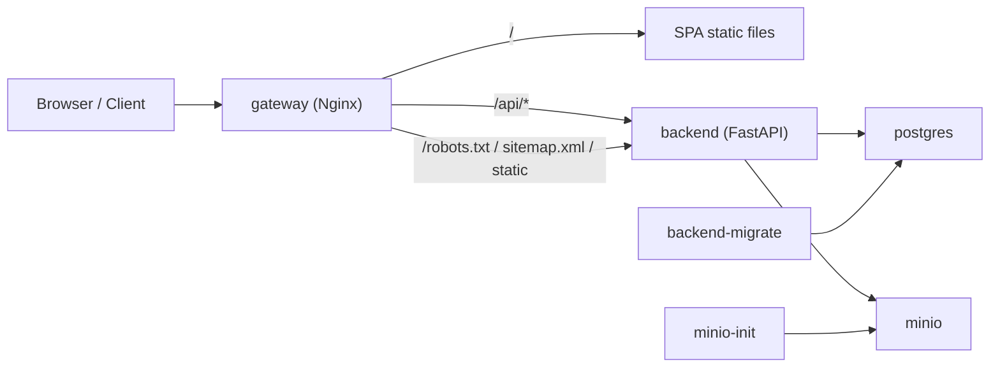

# Архитектура контейнеризации

## Сервисы

- `gateway`: Nginx-контейнер, который раздаёт собранный Vite frontend и проксирует `/api`, `/robots.txt`, `/sitemap.xml`, `/static` на backend.
- `backend`: FastAPI API на `uvicorn`.
- `backend-migrate`: одноразовый init-сервис, который подготавливает и выравнивает схему БД перед запуском API.
- `postgres`: основная реляционная БД.
- `minio`: S3-совместимое объектное хранилище для аватаров и вложений.
- `minio-init`: одноразовый init-сервис для создания bucket и выдачи policy на чтение.

## Сетевая схема

Все контейнеры подключены к общей bridge-сети `app_net`.

## Порядок запуска

1. `postgres` стартует и проходит `healthcheck`.
2. `backend-migrate` выполняет bootstrap схемы и завершает работу с кодом `0`.
3. `minio` стартует, затем `minio-init` создаёт bucket `avatars` и настраивает публичное чтение.
4. `backend` запускается только после успешных `backend-migrate` и `minio-init`.
5. `gateway` стартует после того, как backend становится `healthy`.

## Отказоустойчивость

- При недоступности PostgreSQL `backend` остаётся в состоянии `unhealthy`, а `gateway` не считается готовым.
- При сбое bootstrap/migration `backend-migrate` завершается с ошибкой, и API не стартует.
- При проблемах с MinIO приложение продолжает запускаться, но readiness backend переводится в `degraded`/`503`, что видно по `/health`.
- Вложения опросов скачиваются через backend-relative endpoint, поэтому браузеру не нужен прямой доступ к внутреннему адресу MinIO.
